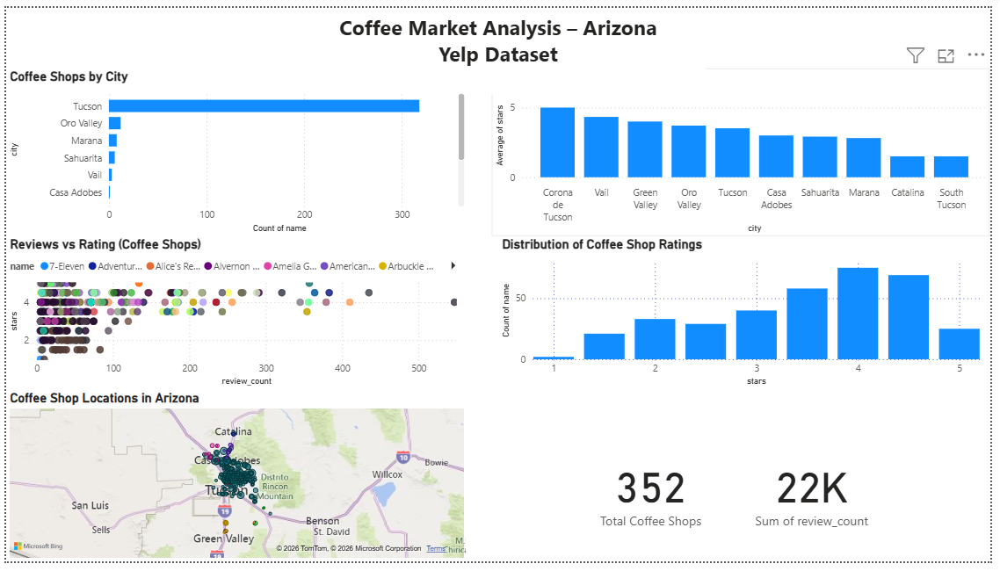

# Arizona Coffee Market Analysis using Yelp Data
Exploratory data analysis of the Arizona coffee shop market using the Yelp Open Dataset.

## Project Overview
This project investigates the structure of the coffee shop market in Arizona using SQL, Python, and Power BI.  
The analysis examines coffee shop distribution across cities, average ratings, review activity, and geographic patterns to identify potential market insights.

## Business Questions
This analysis aims to answer the following questions:

- Which Arizona cities have the highest concentration of coffee shops?
- How do average coffee shop ratings differ across cities?
- Is there a relationship between review volume and ratings?
- Where are coffee shops geographically concentrated?
- What rating ranges are most common among coffee shops?

## Tools Used
- SQL
- Python
- Pandas
- Jupyter Notebook
- Power BI

## Dataset
This project uses data from the Yelp Open Dataset, filtered to focus on coffee-related businesses in Arizona. 
The dataset includes business information, user reviews, tips, and check-in activity. 
For this analysis, the data was filtered to include coffee-related businesses located in Arizona.

Dataset source: https://business.yelp.com/data/resources/open-dataset/

## Project Structure
- `01_prepare_data.ipynb` – data cleaning and preparation
- `02_analysis.ipynb` – SQL-based analysis, exploratory analysis, and visualizations
- `analysis_queries.sql` – core SQL queries used in the project
- `coffee_market_dashboard.pbix` – interactive Power BI dashboard
- `images/dashboard_preview.png` – dashboard preview
- `images/erd_arizona_coffee.png` – entity relationship diagram

## Key Insights
- Tucson has the largest concentration of coffee shops in the filtered dataset
- Some smaller cities show higher average ratings than larger markets
- Most coffee shop ratings are concentrated between 3.5 and 4.5 stars
- Businesses with more reviews tend to cluster in specific areas
- Geographic visualization helps identify concentration patterns around Tucson and nearby areas

## Dashboard Preview

## Entity Relationship Diagram

## Notes
The SQL logic used in the analysis is included in both `02_analysis.ipynb` and `analysis_queries.sql`.

## How to Run This Project
1. Download the Yelp Open Dataset from the official Yelp dataset website.
2. Run `01_prepare_data.ipynb` to clean and filter the data for coffee-related businesses in Arizona.
3. Run `02_analysis.ipynb` to explore the dataset and execute SQL-based analysis queries.
4. Review the SQL logic used in the analysis in `analysis_queries.sql`.
5. Open `coffee_market_dashboard.pbix` in Power BI to explore the interactive dashboard.

## Key Skills Demonstrated
- Data cleaning and preprocessing using Python and Pandas
- SQL queries for exploratory data analysis
- Data modeling and relational schema interpretation
- Data visualization using Power BI
- Geographic visualization of business locations
- Exploratory analysis of ratings and review activity

## Author
Sara Sampaio