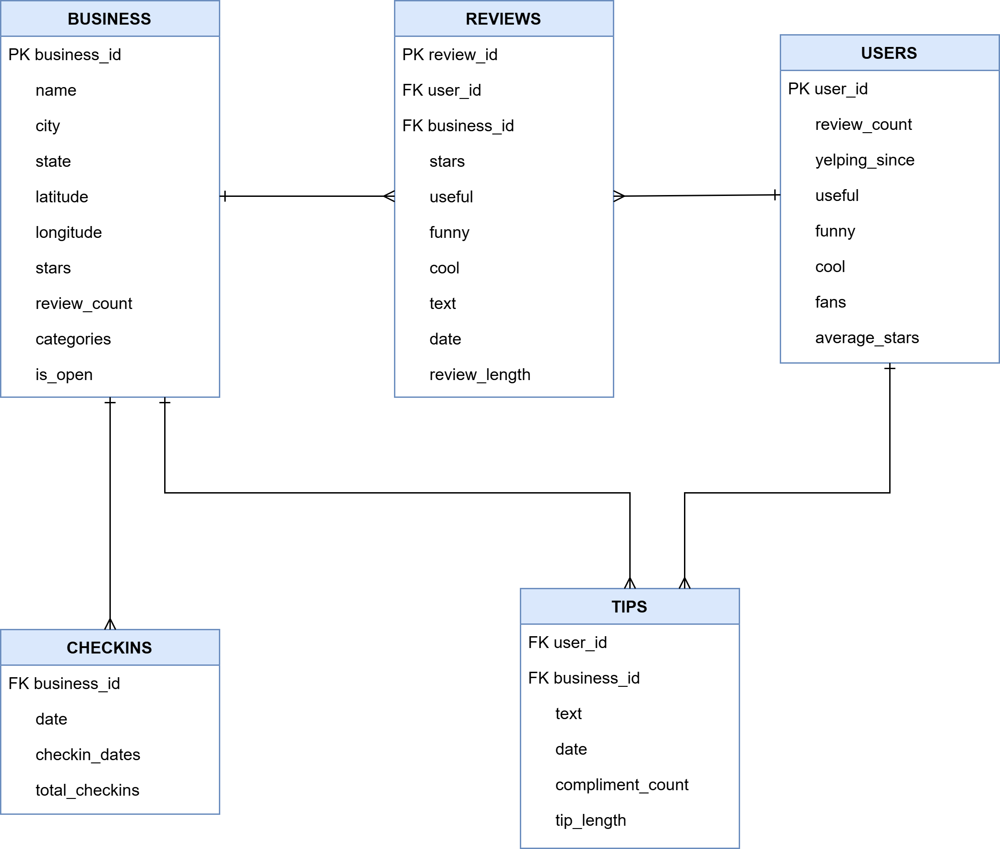

# Coffee Market Analysis
Lean, production-style pipeline for analyzing coffee businesses from the Yelp Open Dataset (Arizona subset).

## What This Project Does
- Filters coffee-related businesses from raw Yelp JSONL files (Arizona subset).
- Builds a clean SQLite database for reproducible analysis.
- Runs SQL queries and exports analysis-ready result tables.
- Includes a Power BI dashboard artifact.`n
## Tech
- Python (`pandas`, `matplotlib`, `sqlite3`)
- SQL (SQLite)
- Power BI

## Dataset
Source: https://business.yelp.com/data/resources/open-dataset/

Required files in `data/raw/`:
- `yelp_academic_dataset_business.json`
- `yelp_academic_dataset_review.json`
- `yelp_academic_dataset_tip.json`
- `yelp_academic_dataset_checkin.json`
- `yelp_academic_dataset_user.json`

## Quick Start
1. Create and activate a virtual environment.
   ```bash
   conda create -n coffee-market python=3.11 -y
   conda activate coffee-market
   ```
2. Install project dependencies:
   ```bash
   pip install -e .
   ```
3. Run:
   ```bash
   coffee-market preprocess --input-dir data/raw --output-dir data/processed
   coffee-market build-db --input-dir data/processed --db-path data/coffee_analysis.db
   coffee-market analyze --db-path data/coffee_analysis.db --sql-file sql/analysis_queries.sql --output-dir reports/sql_results
   coffee-market visualize --db-path data/coffee_analysis.db --output-dir reports/figures
   ```

## Preview


## Data Model



